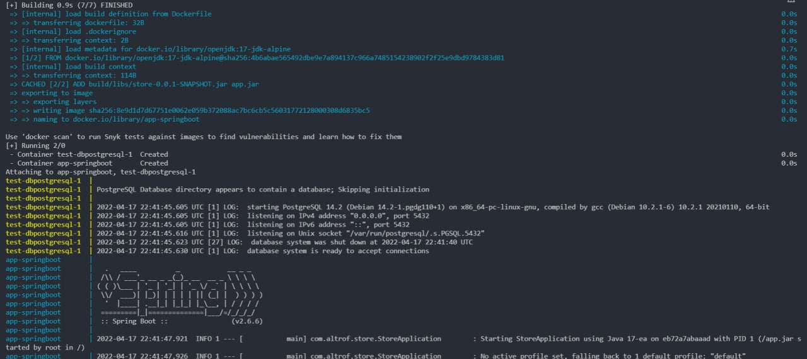
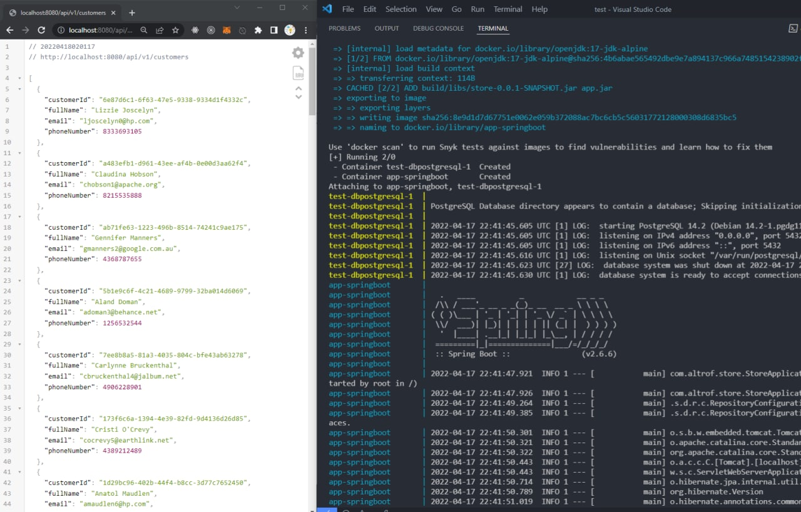
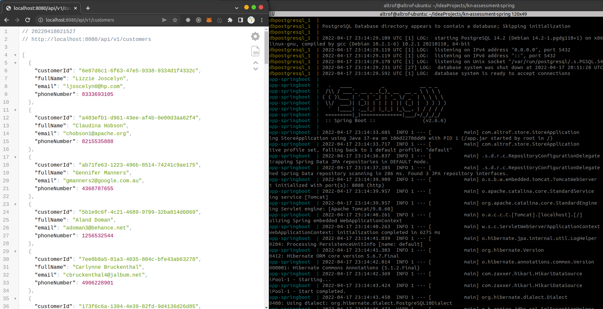

# Containerized application with Docker after built by Gradle

- [Instruction for running an application using only one Docker](#instruction-for-running-an-application-using-only-one-docker)
    - [Installation Docker](#installation-docker)
      - [Windows](#windows)
      - [Linux (the easiest way)](#linux-the-easiest-way)
      - [Linux (correctly)](#linux-correctly)
    - [Run an application](#run-an-application)
    - [Some examples of working app](#some-examples-of-working-app)
      - [Example on Windows](#example-on-windows)
      - [Example on Linux (Ubuntu)](#example-on-linux-ubuntu)

  

## Instruction for running an application using only one Docker.

### Installation Docker
1. First of all, you have to install a Docker to your pc.
    #### Windows:
        Go to the https://www.docker.com/get-started/
        Choose Docker Desktop and download.

        Here is default installation for all Windows applications.
        However in the end it maybe ask to download WSL 2 and Kernel.
        https://docs.microsoft.com/en-us/windows/wsl/install-manual#step-4---download-the-linux-kernel-update-package
        Please do 1-5 steps. After that you are ready! :)
    #### Linux (the easiest way):
        Install a snap for your Linux (at example on Ubuntu).
        https://snapcraft.io/docs/getting-started

        sudo apt update
        sudo apt install snapd

        After that sudo snap install docker
    
        sudo addgroup --system docker
        sudo adduser $USER docker
        newgrp docker
        sudo snap disable docker
        sudo snap enable docker

        Thats all for installation docker via snap :)
    #### Linux (correctly)
        Actually its a hard way, what I am not recommend for beginners :D ...
        But this is the right way to installation.
        If do everything as written in documentation step by step and very carefully, then it will be work.

        Docker Documentation: https://docs.docker.com/engine/install/

### Run an application

2. After when Docker is installed, then need to **clone this repo from docker branch** as was said in main branch.
    Or just Download as ZIP.
3. Open the directory folder of project in terminal (shell, bash, cmd). 
4. Write _`docker-compose up --build`_
   And you must get something like on screenshot. 
  
   

## Some examples of working app

### Example on Windows

### Example on Linux (Ubuntu)
