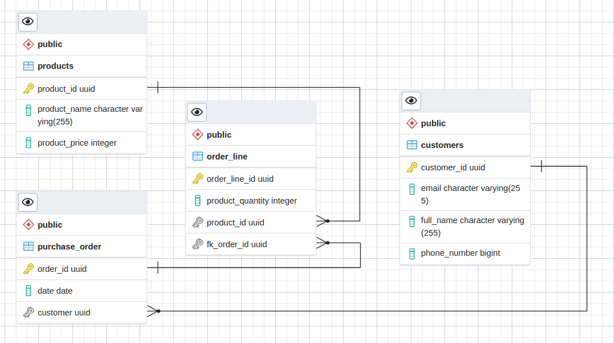
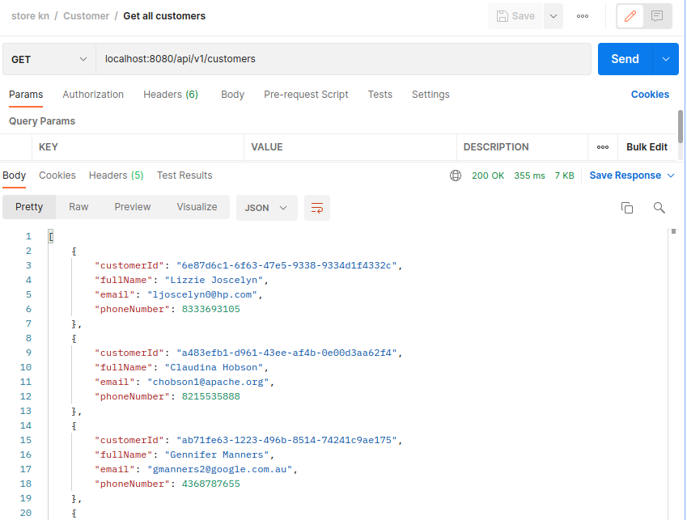
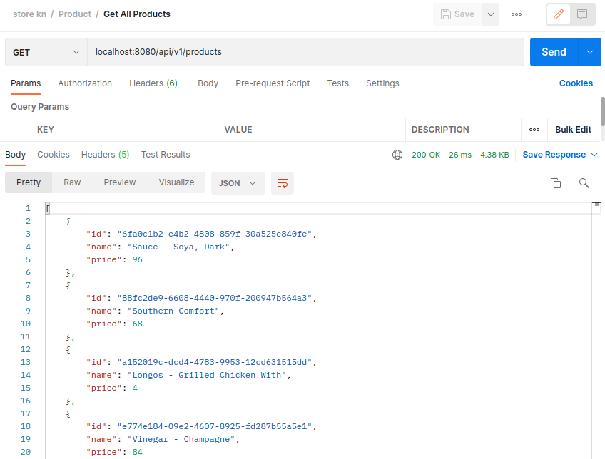
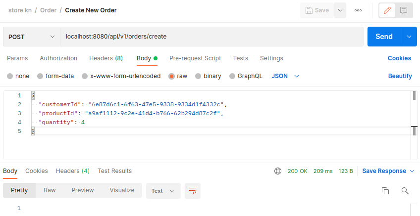
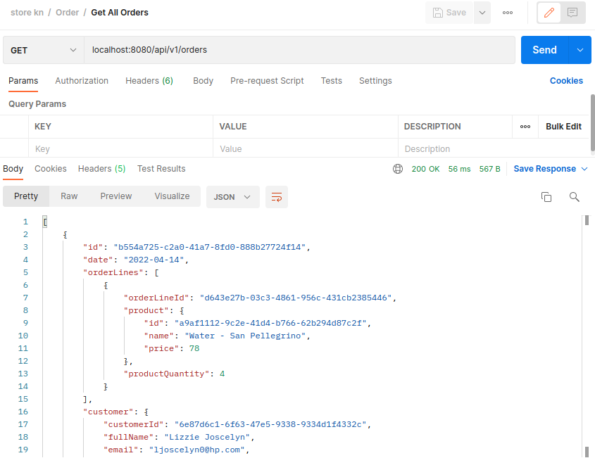
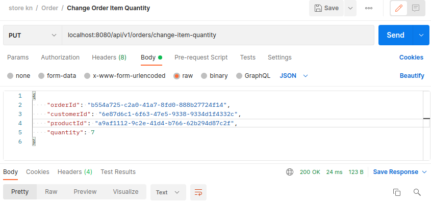
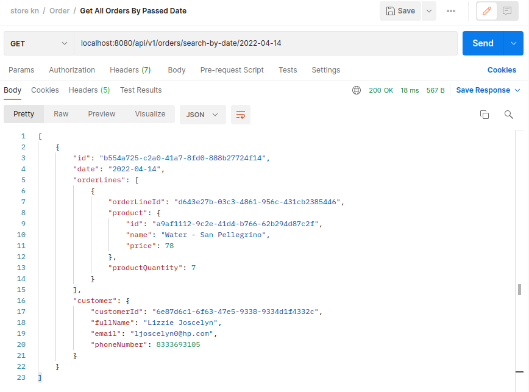
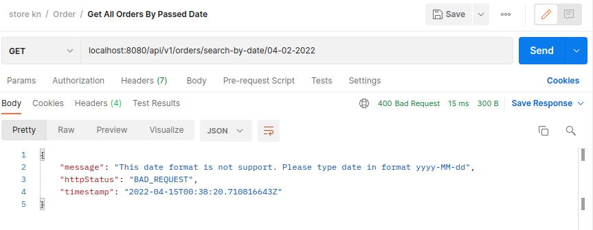

# kn-assessment-spring

- [Order Management System API](#order-management-system-api)
  - [Tech stack](#tech-stack)
  - [Project Architecture](#project-architecture)
  - [Model Description](#model-description)
  - [PostgreSQL Diagram](#postgresql-diagram)
- [API V1](#api-v1)
  - [Requests](#requests)
  - [Handled Exceptions](#handled-exceptions)
  - [Some Example Requests with Postman](#some-example-requests-with-postman)
- [How To](#how-to)
  - [Run an application with docker (The Easiest way)](#run-an-application-with-docker-the-easiest-way)
  - [Run an application without docker](#run-an-application-without-docker)

# Order Management System API

## Tech stack
    - Java 17 and for project building is Gradle
    - SpringBoot and SpringData (JPA) + Lombok 
    - Database for main project was PostgreSQL 14.2
    - Database for tests was H2 (in-memory).
    - Docker with Docker Compose for containerize 

## Project Architecture
    - For this project was used N Tier Architecture
    - For every entity was created own Model Description, Controller, Repository (JPA)

## Model Description:
 	- An Order is made of N OrderLine and is related to a Customer, and has a date of submission
	- Each OrderLine is made of a Product and a quantity
	- A Product has a id, name, unitPrice
	- A Customer has a id, fullName, email, telephone

## PostgreSQL Diagram

## API V1
### Requests
 *For all these requests, Content-Type is `application/json`* 

| Method   | Url                                                | Passing Properties                                                                            | Description                                                                 | Example passing props                                                                                                       |
|----------|----------------------------------------------------|-----------------------------------------------------------------------------------------------|-----------------------------------------------------------------------------|-----------------------------------------------------------------------------------------------------------------------------|
| **GET**  | _`/api/v1/customers/`_                             | -                                                                                             | Return a list of customers                                                  | -                                                                                                                           |
| **POST** | _`/api/v1/customers/create`_                       | JSON { "fullName": VARCHAR,  "email": VARCHAR, "phoneNumber": INTEGER }                       | Create a new customer with passed properties                                | { "fullName": "John Smith", "email": "john.smith@mail.com", "phoneNumber": 56123987 }                                       |
| **GET**  | _`/api/v1/products/`_                              | -                                                                                             | Return a list of products                                                   | -                                                                                                                           |
| **POST** | _`/api/v1/products/create/`_                       | JSON {"name": VARCHAR, "price": INTEGER }                                                     | Create a new product with passed properties                                 | { "name": "MacBook Air M1", "price": 2500 }                                                                                 |
| **GET**  | _`/api/v1/orders/`_                                | -                                                                                             | Return a list of orders                                                     | -                                                                                                                           |
| **GET**  | _`/api/v1/orders/search-by-date/{date}`_           | date = VARCHAR                                                                                | Return a list of orders by passed date in format YYYY-MM-DD (NB! zone: UTC) | /2022-02-02                                                                                                                 |
| **GET**  | _`/api/v1/orders/search-by-product/{productId}`_   | product = VARCHAR                                                                             | Return a list of orders by passed product id                                | /6fa0c1b2-e4b2-4808-859f-30a525e840f                                                                                        |
| **GET**  | _`/api/v1/orders/search-by-customer/{customerId}`_ | customerId = VARCHAR                                                                          | Return a list of orders by passed customer id                               | /6e87d6c1-6f63-47e5-9338-9334d1f4332c                                                                                       |
| **GET**  | _`/api/v1/orders/{orderId}`_                       | orderId = INTEGER                                                                             | Return an order by passed order id                                          | /3f3ef614-c746-47e0-8494-462a7ee34773                                                                                       |
| **POST** | _`/api/v1/orders/create`_                          | JSON { "customerId": VARCHAR, "productId": VARCHAR, "quantity": INTEGER }                     | Create an order by passed customer id, product id and product quantity      | { "customerId": "6e87d6c1-6f63-47e5-9338-9334d1f4332c", "productId": "a9af1112-9c2e-41d4-b766-62b294d87c2f", "quantity": 4} |
| **PUT**  | _`/api/v1/orders/change-item-quantity`_            | JSON { "orderId": VARCHAR, "customerId": VARCHAR, "productId": VARCHAR, "quantity": INTEGER } | Update a quantity of product in order by passed order line id and quantity  | { "customerId": "6e87d6c1-6f63-47e5-9338-9334d1f4332c", "productId": "a9af1112-9c2e-41d4-b766-62b294d87c2f", "quantity": 8} |

## Handled Exceptions
#### Handlers will throws exceptions if:
1. Customer, product or order is not present with passed UUID.
2. Value of quantity what passed is zero or negative.
3. One or more arguments not passed.
4. Product or Customer is already exist in list.
5. Date, UUID or Email not passed validation by validators.

  

### Some Example Requests with Postman

> #### *Get All Customers*
> 
> 

> #### *Get All Products*
>
> 

> #### *Create New Order*
>
> 

> #### *Get All Orders*
>
> 

> #### *Change Quantity of Product in Order*
>
> 

> #### *Get All Orders By Passed Date*
>
> 

> #### *Error for Request "Get All Orders" By Passed Wrong Format Date*
>
> 

# How To

## Run an application with docker (The Easiest way)
Please move to the branch: <a href="https://github.com/altrof/kn-assessment-spring/tree/docker"> _`docker`_ </a>

## Run an application without docker
1. Clone repo from main branch.
2. You may have a Postgresql or another SQL on your PC. 
   But if you choose or have another SQL, then you'll have to tweak a bit more.
3. You have to create a database, at example in my project its "store".
4. In project file application.properties you have to change:  
    Database name into url and username with password. (for PostgreSQL)  
    For another SQL you have to configure file application.properties as in docs.
5. When database successfully connected with project, then you will need only RUN.